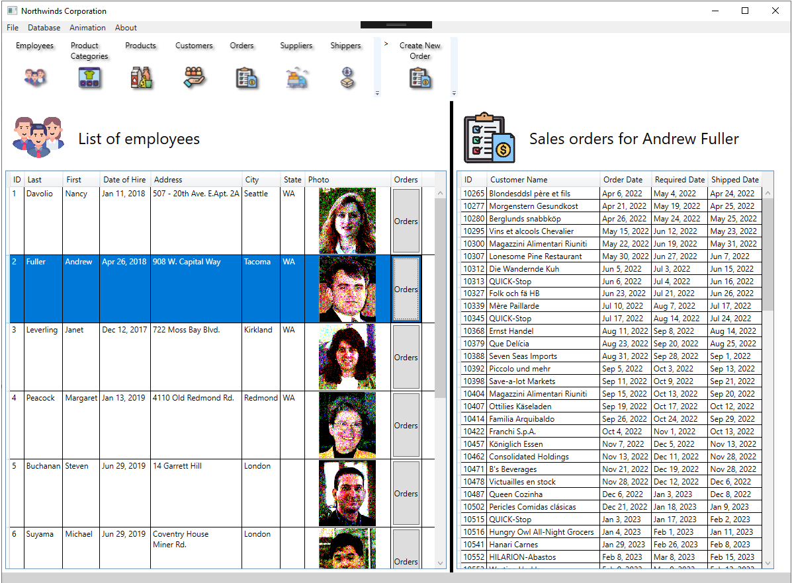
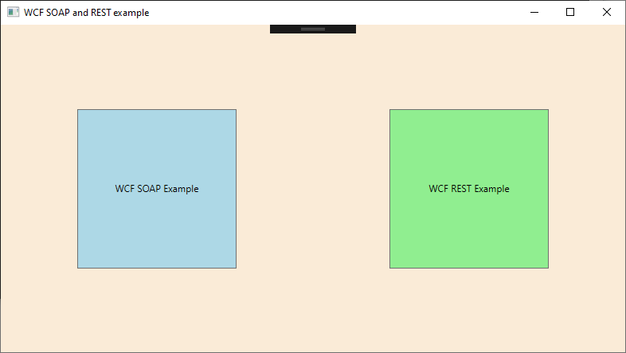
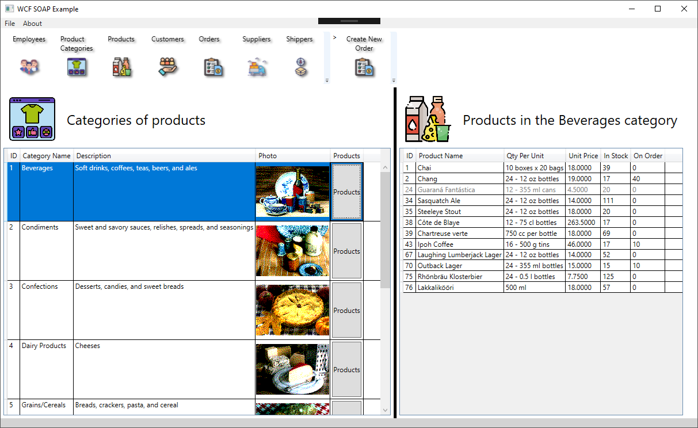
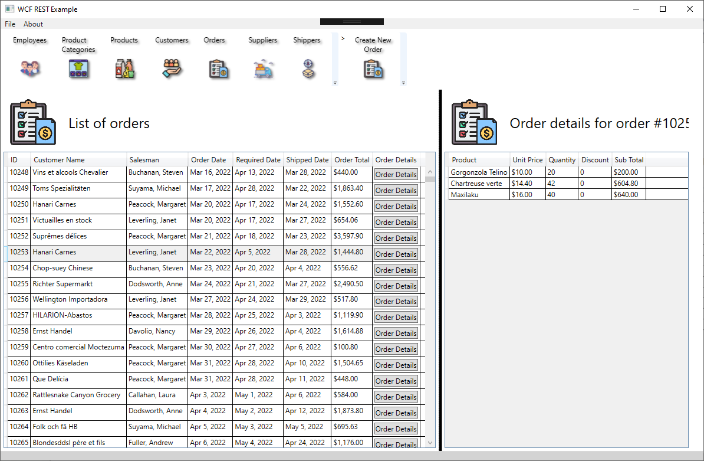
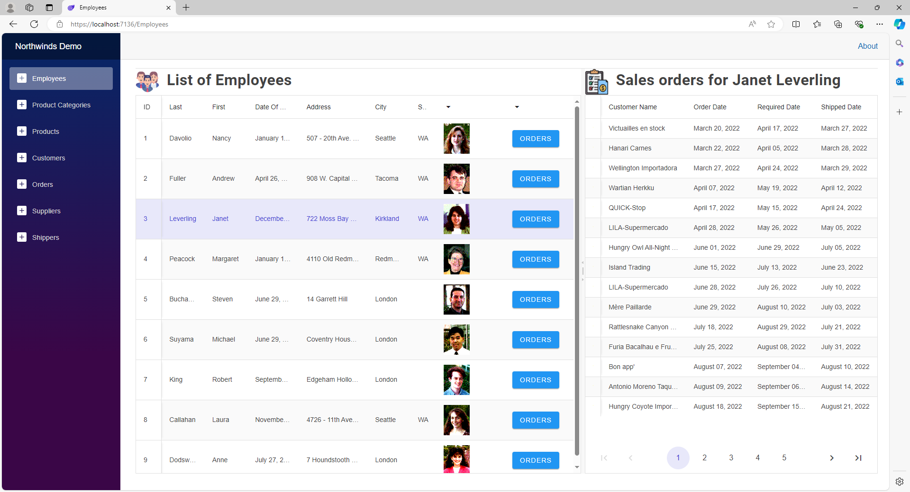
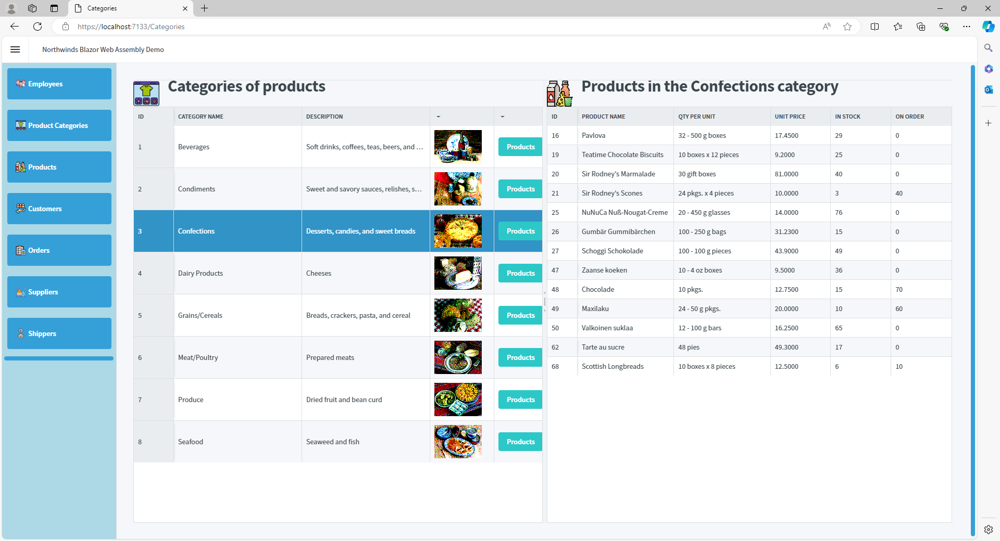
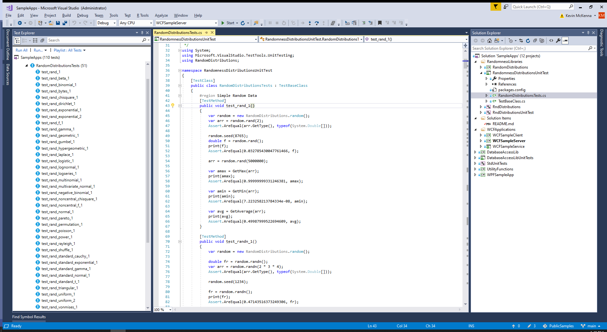

**This is a public repository of sample applications written by Kevin McKenna/Baseline Software Solutions.**

The applications in this repository make use of the famous Microsoft "Northwinds" sample database from the 1990s.  This data has been updated to be used in modern SQL Server instances.  

The NorthwindsDB directory contains SQL server backups and also SQL script that can be used to recreate the database.  It also contains NorthwindsDB.xml which is the entire database in XML.
All the demo applications can load the XML version for an easy demo without having to load a SQL database.

**WPFSampleApp** - This application is written entirely in C# with a WPF based GUI.  It makes heavy use of layout, styles, templates, converter functions and binding.
The database is accessed using EntityFramework with Linq operations. The configuration file allows the application to switch between a SQL Server database and "in memory" version of the database loaded from an XML file as not everyone can or wants to install a new database.
We also have some slick animations of windows loading and unloading.

**WCFApplications** - This folder contains three projects.  

***- WCFSampleService*** This library is a WCF service implementation. It can be hosted within a desktop/console application or it can be hosted via IIS.  For this demo we choose to host it via a console application.

***- WCFSampleServer*** This console application is simply used to host the WCFSampleService library which contains all the important code. **Important:** This application must be started as an administrator because it opens a network port.

***- WCFSampleClient*** This WPF based GUI application serves as the client application that displays data from the WCFSampleService.  The GUI is almost identical to the WPFSample application.  The difference is that this application retrieves the data over WCF SOAP and REST connections.  Two different windows allow access the web service via SOAP and REST.

**BlazorSampleApp** - This folder contains a Blazor Server application.  It is written in C#, .NET core with Radzen Blazor as the UI framework.  SQL, LINQ, Async/await pattern.

**BlazorSampleWebAssembly** - This folder contains a Blazor Web Assembly App hosted by IIS.  It is written in C#, .NET core with Radzen Blazor as the UI framework.  SQL, LINQ, Async/await pattern, web services.

**RandomnessLibraries** - This directory contains two libraries of random number generator and common statistical distributions of those random numbers. Each library has an associated collection of unit tests for the statistical distributions. 

One library is written in C# and the other in C++. 

These libraries have been ported from the open source https://github.com/Quansight-Labs/numpy.net which was also developed by Kevin McKenna.  These versions do not have a numpy dependency.

**CLISamples** - (Requires VS2022) This console application demonstrates the usage of the Microsoft command line library found here: https://learn.microsoft.com/en-us/dotnet/standard/commandline/

